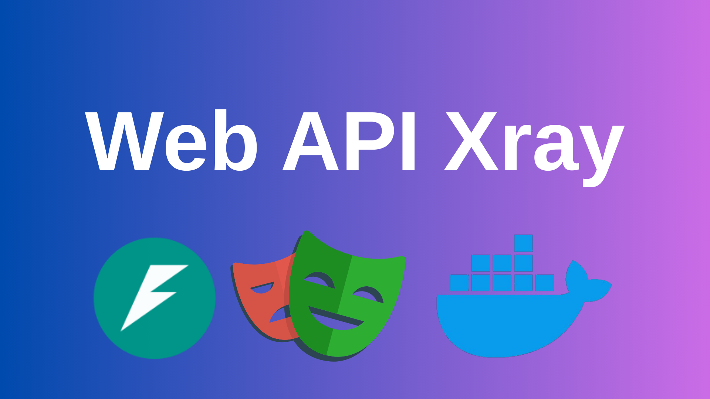

# web-api-xray

Web API Xray is a FastAPI-based service that uses Playwright and Docker to launch a real browser, observe network traffic, and capture backend API requests and responses from JavaScript-rendered web pages.
